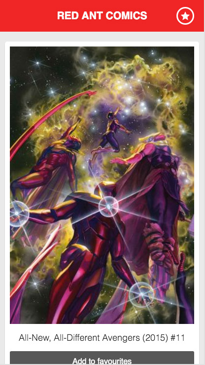

# FrontEnd Exercise
The objective is to create an app called 'Red Ant Comics'. This app will comprise of a listing page of comics with the ability to add comics to a favourites list.

In this excerise we are looking to for understandable structure, clear seperation of responsibilites, clean code and to see that you are mindful of others reviewing and extending the code in future.

Please ensure that you use React.js components and the Redux design pattern. There are no other restrictions on which frameworks you use to create this app.

The HTML and CSS has been provided for you. For the comic and favourites listings the list item templates are within HTML comments.



You will be evaluated on your ability to integrate with a RESTful JSON API including connections/error handling and your ability to structure the app appropriately.

The data will be provided by the Marvel API.

## Technical details

### Getting started
* Clone this project

### API
You will need to use the following url to request the comics endpoint from the Marvel API:

[https://gateway.marvel.com/v1/public/comics?apikey=3cb62d086d5debdeea139095cbb07fe4&ts=redant&hash=140e85a50884cef76d614f6dacada288](https://gateway.marvel.com/v1/public/comics?apikey=3cb62d086d5debdeea139095cbb07fe4&ts=redant&hash=140e85a50884cef76d614f6dacada288)

#### Additional details

- **Documentation:** [http://developer.marvel.com/documentation/generalinfo](http://developer.marvel.com/documentation/generalinfo)
- **List of end points:** [http://developer.marvel.com/docs](http://developer.marvel.com/docs)
- **Image formats** [http://developer.marvel.com/documentation/images](http://developer.marvel.com/documentation/images)

#### Images

The API will provide part of the image url and the extension. To get the full valid URL you will need to select an image size and append into the URL (sizes are show within the Image formats link above). For example the following link is using 'portrait_uncanny' image size.

http://i.annihil.us/u/prod/marvel/i/mg/3/40/4bb4680432f73/portrait_uncanny.jpg

### Favourites

To open the favourites panel (```#favourites-panel```) you need to add a class of ```open```. Toggling this class will show/hide the panel.

* Each comic within the list should have a button to add to the list
* If the comic is already in the list the add button should be changed so you can remove it
* There should be a list that displays all the favourites
* The comics within the favourites list should have a button to remove

**Have fun!**
